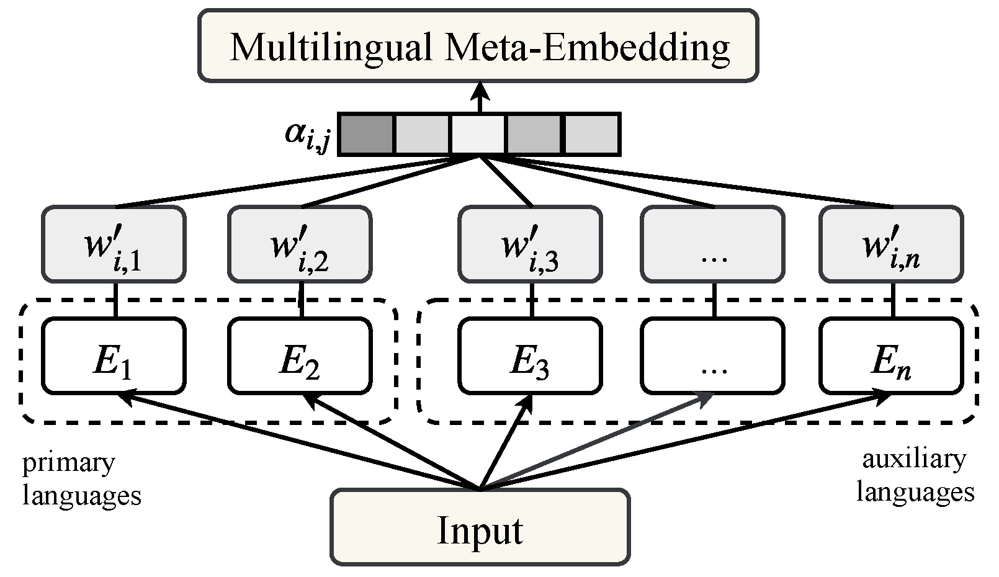

## Learning Multilingual Meta-Embeddings
### Genta Indra Winata, Zhaojiang Lin, Pascale Fung

 [](https://opensource.org/licenses/MIT) 

This is the implementation of our papers accepted in RepL4NLP and EMNLP 2019. You can find our paper [here](https://www.aclweb.org/anthology/W19-4320) and [here](https://arxiv.org/pdf/1909.08504.pdf). 

This code has been written using PyTorch. If you use any source codes or datasets included in this toolkit in your work, please cite the following paper.
```
@inproceedings{winata-etal-2019-learning,
    title = "Learning Multilingual Meta-Embeddings for Code-Switching Named Entity Recognition",
    author = "Winata, Genta Indra  and
      Lin, Zhaojiang  and
      Fung, Pascale",
    booktitle = "Proceedings of the 4th Workshop on Representation Learning for NLP (RepL4NLP-2019)",
    month = aug,
    year = "2019",
    address = "Florence, Italy",
    publisher = "Association for Computational Linguistics",
    url = "https://www.aclweb.org/anthology/W19-4320",
    pages = "181--186",
}
```

```
@article{winata2019hierarchical,
  title={Hierarchical Meta-Embeddings for Code-Switching Named Entity Recognition},
  author={Winata, Genta Indra and Lin, Zhaojiang and Shin, Jamin and Liu, Zihan and Fung, Pascale},
  journal={arXiv preprint arXiv:1909.08504},
  year={2019}
}
```

## Description
In countries that speak multiple main languages, mixing up different languages within a conversation is commonly called code-switching. Previous works addressing this challenge mainly focused on word-level aspects such as word embeddings. However, in many cases, languages share common subwords, especially for closely related languages, but also for languages that are seemingly irrelevant. Therefore, we propose Hierarchical Meta-Embeddings (HME) that learn to combine multiple monolingual word-level and subword-level embeddings to create language-agnostic lexical representations. On the task of Named Entity Recognition for English-Spanish code-switching data, our model achieves the state-of-the-art performance in the multilingual settings. We also show that, in cross-lingual settings, our model not only leverages closely related languages, but also learns from languages with different roots. Finally, we show that combining different subunits are crucial for capturing code-switching entities. 

## Data
English-Spanish Twitter Dataset in CoNLL format. Due to copyright and privacy issue, we cannot share the dataset in this repository, but you can contact the Shared Task committee or crawl the data by following the instructions in the [Shared Task Website](https://code-switching.github.io/2018/). You can reuse this code and apply our method in other datasets. 

Please check the format [here](sample.txt)

## Model Architecture


## Setup
- Install PyTorch (Tested in PyTorch 1.0 and Python 3.6)
- Install library dependencies:
```console
pip install tqdm numpy
```
- Download pre-trained word embeddings.
In this paper, we were using English, Spanish, Catalan, and Portuguese FastText and an English Twitter GloVe. We generated word embeddings for all words to remove out-of-vocabulary and let the model learns how to choose and combine embeddings.

- Subword embeddings
The code will automatically download subword embeddings using bpeemb library.

## Train
* ```--emb_list```: list all pre-trained word embeddings
* ```--use_crf```: add an CRF layer
* ```--model_dir```: define the location of the saved model
* ```--lr```: tune the learning rate
* ```--batch_size```: number of samples in each batch
* ```--mode```: ``concat`` or ``linear`` or ``attn_sum``
* ```--no_projection```: to remove the projection layer (especially for CONCAT)
* ```--no_word_emb```: remove word embeddings
* ```--early_stop```: to early stop
* ```--bpe_lang_list```: List of BPE languages
* ```--bpe_emb_size```: BPE embeddings size (default: 300)
* ```--bpe_vocab```: BPE vocab (default: 5000)
* ```--bpe_hidden_size```: BPE hidden size
* ```--bpe_cache```: path to store BPE embeddings

### How to run
#### CONCAT
```console
python train.py --emb_list embedding/all_vocab_en_es_crawl-300d-2M-subword.vec embedding/all_vocab_en_es_cc.es.300.vec embedding/glove.840B.300d.txt --cuda --use_crf --model_dir concat_eng_spa_trfs_crf_lr0.1_lossmse_en_es --lr 0.1 --batch_size 32 --mode concat --no_projection
```

#### LINEAR
```console
python train.py --emb_list embedding/all_vocab_en_es_crawl-300d-2M-subword.vec embedding/all_vocab_en_es_cc.es.300.vec embedding/glove.840B.300d.txt --cuda --use_crf --model_dir concat_eng_spa_trfs_crf_lr0.1_lossmse_en_es --lr 0.1 --batch_size 32 --mode linear
```

#### Hierarchical Meta-Embeddings
Word only
```console
python train.py --emb_list embedding/all_vocab_en_es_crawl-300d-2M-subword.vec embedding/all_vocab_en_es_cc.es.300.vec embedding/glove.840B.300d.txt --cuda --use_crf --model_dir concat_eng_spa_trfs_crf_lr0.1_lossmse_en_es --lr 0.1 --batch_size 32 --mode attn_sum
```

Word + BPE
```console
python train.py --emb_list embedding/all_vocab_en_es_crawl-300d-2M-subword.vec embedding/all_vocab_en_es_cc.es.300.vec embedding/all_vocab_en_es_cc.br.300.vec embedding/all_vocab_en_es_cc.cy.300.vec embedding/all_vocab_en_es_cc.ga.300.vec embedding/all_vocab_en_es_cc.gd.300.vec embedding/all_vocab_en_es_cc.gv.300.vec embedding/glove.840B.300d.txt --cuda --model=TRFS --use_crf --model_dir eng_spa_trfs_crf_mse0_lr0.1_lossmse_en_es_br_cy_ga_gd_gv_glove_all_vocab_bpe --lr 0.1 --batch_size 32  --early_stop 15 --bpe_lang_list en es br cy ga gd gv
```

Word + char
```console
python train.py --emb_list embedding/all_vocab_en_es_crawl-300d-2M-subword.vec embedding/all_vocab_en_es_cc.es.300.vec embedding/all_vocab_en_es_cc.br.300.vec embedding/all_vocab_en_es_cc.cy.300.vec embedding/all_vocab_en_es_cc.ga.300.vec embedding/all_vocab_en_es_cc.gd.300.vec embedding/all_vocab_en_es_cc.gv.300.vec embedding/glove.840B.300d.txt --cuda --model=TRFS --use_crf --model_dir eng_spa_trfs_crf_char_mse0_lr0.1_lossmse_en_es_br_cy_ga_gd_gv_glove_all_vocab --lr 0.1 --batch_size 32  --early_stop 15 --add_char_emb
```

## Test
To evaluate the F1 score, generate attention scores and save them into a file.
```console
python test.py --emb_list embedding/all_vocab_en_es_crawl-300d-2M-subword.vec embedding/all_vocab_en_es_cc.es.300.vec embedding/glove.840B.300d.txt --cuda --use_crf --model_dir concat_eng_spa_trfs_crf_lr0.1_lossmse_en_es --lr 0.1 --batch_size 32 --mode attn_sum
```

## Attention


## Bug Report
Feel free to create an issue or send email to giwinata@connect.ust.hk
